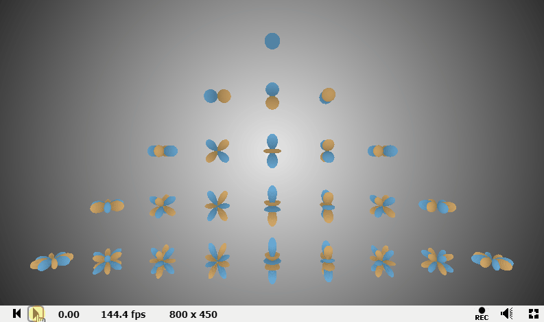
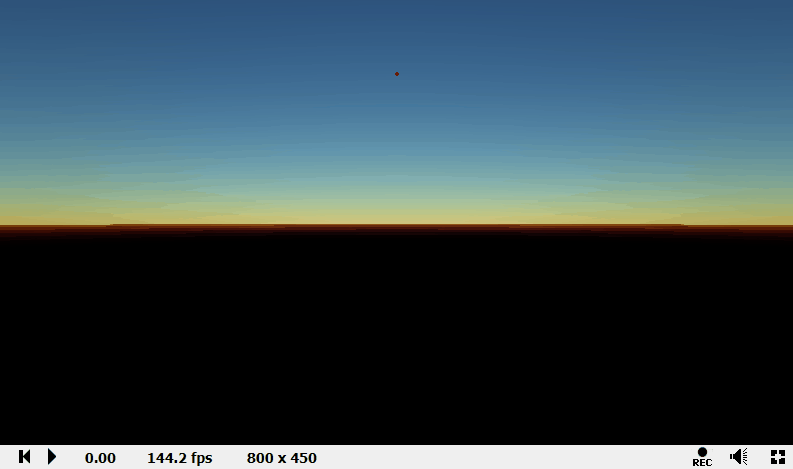
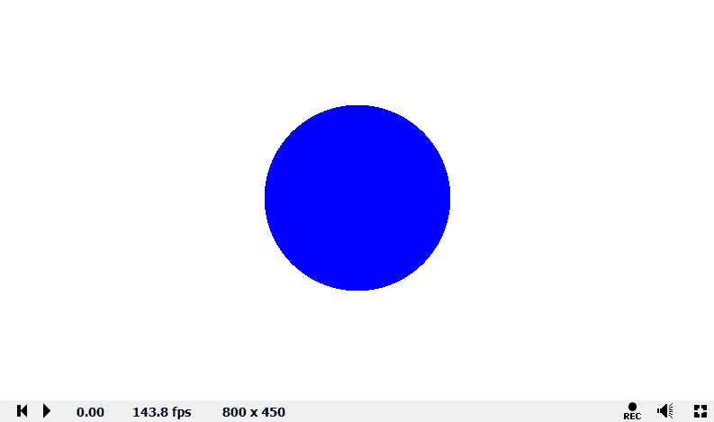

# Ptilopsis

Graphics algorithms and techniques implemented in (GLSL) shaders, which can be exectued in ShaderToy.

## Usage
 - Generate executable code in ShaderToy: execute `GenerateShaderToyCode.bat` in project root directory.
 - Generated files:
	- `Common.glsl`: Basic code for this project, includes ray tracing, sampling, etc.
	- `BufferA.glsl`: Code for interactive camera.

## Implementated algorithms/techinques
(Preview of implemented results/GIFs may requrie some time...)

|||
| - | - |
|  |  |
| Visualize spherical harmonics(Order 0-4) | Encoding environtment map to spherical harmonics |
|  |  |
| Atmosphere rendering with ray marching | Interactive camera & ray tracing framework |
